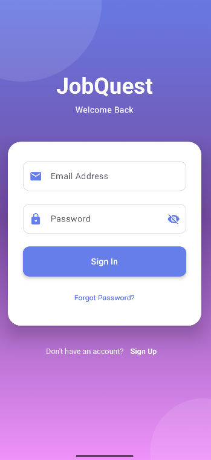
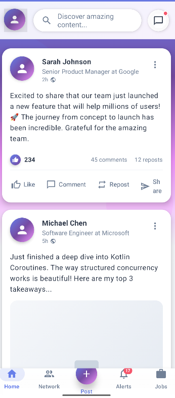
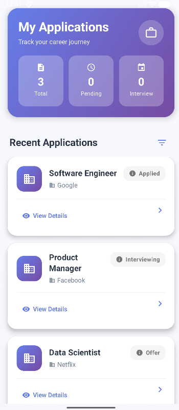
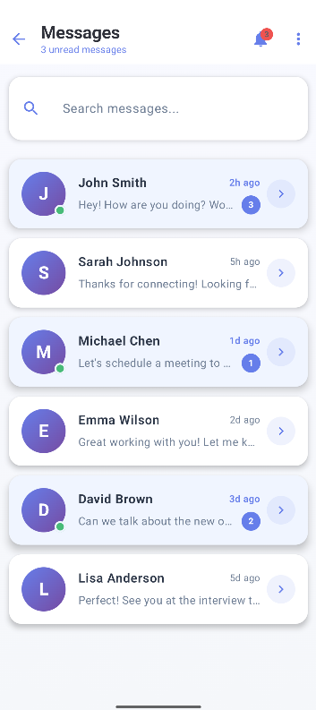
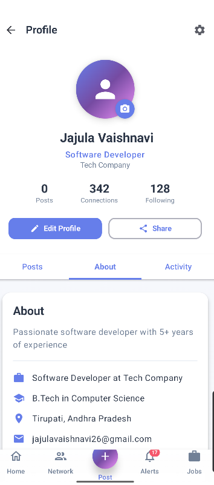

# JobQuest – Job Search & Networking App

## 📌 Overview
JobQuest is an Android application designed to help users search for jobs, connect with professionals, apply for opportunities, and track application status – all in one secure platform.

---

## ✨ Features
✔ User Registration & Login (Email, Google)  
✔ Home Feed – View Jobs, Posts & Updates  
✔ Job Search with filters (Title, Location, Skills)  
✔ Post Job Openings, Portfolio, Videos & Documents  
✔ Messaging – Chat, Voice Notes, File Sharing  
✔ Network – Send, Accept, Ignore Connections  
✔ Track Job Status – Applied, Interview Scheduled, Offer Received  
✔ Profile Management – Photo, Bio, Skills, Experience  
✔ Settings – Privacy, Password Update, 2FA, Active Status Control  

---

## 🛠 Tech Stack
| Feature           | Technology Used               |
|-------------------|-------------------------------|
| Frontend          | Android (Kotlin)              |
| Backend           | Firebase (Auth, Firestore, Storage) |
| UI Design         | XML, Material Design          |
| Tools             | Android Studio, GitHub        |

---

## 📂 Project Structure
JobQuestApp/
├── app/src/main/java/... → Activities & Logic
├── app/src/main/res/layout/ → XML Layout Files
├── app/src/main/res/drawable/ → Icons & Images
├── app/google-services.json → Firebase Configuration
└── README.md

---

## 🚀 How to Run the Project
1. Clone the repository:  
2. Open the project in Android Studio  
3. Connect Firebase & add `google-services.json`  
4. Sync Gradle → Run on Emulator or Physical Device  

---

## 📸 Screenshots (You can add later)
### 1. Login Page  
This is the first screen where users can log in using email and password.

### 2. Home Feed  
Displays available job posts and recommendations.

### 3. Job Details  
Users can view full job descriptions, company info, and apply.

### 4. Messaging  
Chat interface to communicate with recruiters or other users.

### 5. Profile  
Shows user's personal details, saved jobs, and activity.

## 📈 Future Enhancements
- Dark Mode  
- AI Job Recommendations  
- Resume Builder  
- Video Call for Interviews  

---

## 👩‍💻 Developer
**Bala Vaishnavi J**  
Android Developer Intern – ApexPlanet Software Pvt Ltd  

GitHub Repo:  
https://github.com/BALAVAISHNAVIJ2006/JobQuestApp
